# Laporan Praktikum Sistem Operasi

> Nama : Maulana Zaki Putra Zakaria

> NRP : 5027251009

> Asisten : MOO | Asisten Kalkuluz

## Soal: Save Asisten Kenz

### Deskripsi Singkat

Pada soal ini, ditugaskan untuk membuat sebuah *Custom File System* menggunakan teknologi FUSE (*Filesystem in Userspace*) di bahasa C. Sistem *file* ini bertindak sebagai "cermin" (*mirroring*) dari sebuah direktori sumber (*source directory*) ke sebuah direktori tujuan (*mount point*). Namun, sistem ini memiliki keunikan berupa injeksi **Virtual File**. Di dalam *mount point*, FUSE akan secara otomatis menciptakan sebuah file bayangan bernama `tujuan.txt` yang sebenarnya tidak pernah ada di dalam direktori sumber. Jika file `tujuan.txt` ini dibaca, program FUSE akan langsung mengeksekusi proses perangkaian kata dengan membuka file `1.txt` hingga `7.txt` di direktori sumber, mencari baris spesifik yang berawalan "KOORD: ", lalu menggabungkannya menjadi satu kalimat utuh berbunyi "Tujuan Mas Amba: [hasil gabungan koordinat]".

---

### Penjelasan Kode: File FUSE (`kenz_rescue.c`)

File ini berisi implementasi fungsi-fungsi standar *filesystem* POSIX (seperti *getattr*, *readdir*, *open*, dan *read*) yang sudah ditimpa (*override*) menggunakan struktur operasi FUSE.

#### 1. Import Library dan Deklarasi Variabel Global

```c
#define FUSE_USE_VERSION 28
#include <fuse.h>
#include <stdio.h>
#include <string.h>
#include <unistd.h>
#include <fcntl.h>
#include <dirent.h>
#include <errno.h>
#include <sys/time.h>
#include <stdlib.h>

char source_dir[1024];

```

**Penjelasan:**

* **`#define FUSE_USE_VERSION 28`**: Ini adalah makro krusial yang wajib diletakkan di baris paling atas sebelum *include* `<fuse.h>`. Makro ini mendikte *compiler* untuk menggunakan API FUSE versi 2.8, agar struktur fungsi dan parameter yang digunakan sesuai dan kompatibel.
* **Library Sistem**: Menggunakan library standar C dan POSIX seperti `<dirent.h>` untuk manajemen direktori, `<fcntl.h>` untuk kontrol pembukaan *file*, dan `<errno.h>` untuk mengirimkan kode *error* sistem operasi (seperti *File not found* atau *Permission denied*).
* **`source_dir[1024]`**: Variabel global untuk menyimpan *absolute path* (jalur mutlak) dari direktori sumber (contoh: `/home/zaki/amba_files`). Variabel ini dibuat global agar bisa diakses oleh seluruh fungsi operasi FUSE di bawahnya.

#### 2. Fungsi Ekstraksi dan Penggabungan Data (Virtual File Generator)

```c
void generate_tujuan(char *content){
    strcpy(content, "Tujuan Mas Amba: ");

    for (int i = 1; i <= 7; i++ ){
        char filepath[1024];
        sprintf(filepath, "%s/%d.txt", source_dir, i);
        FILE *f = fopen(filepath, "r");

        if(f){
            char line[256];
            while (fgets(line, sizeof(line), f)){
                if (strncmp(line, "KOORD: ", 7)==0){
                    char frag[256];
                    strcpy(frag, line + 7);

                    size_t len = strlen(frag);
                    if(len > 0 && frag[len-1] == '\n') frag[len-1] = '\0';
                    if(len > 1 && frag[len-2] == '\r') frag[len-2] = '\0';

                    strcat(content, frag);
                    break;
                }
            }
            fclose(f);
        }
    }
    strcat(content, "\n");
}

```

**Penjelasan:**
Fungsi `generate_tujuan` adalah mesin utama pembuat isi file `tujuan.txt`.

* **Looping File**: Program melakukan perulangan dari 1 hingga 7 untuk membuka file `1.txt` sampai `7.txt` yang berada di dalam `source_dir`.
* **Pencarian Pola (Parsing)**: Fungsi `fgets` membaca file per baris, lalu `strncmp` memfilter baris yang hanya diawali dengan teks `"KOORD: "`.
* **Pembersihan Karakter Baru (*Sanitation*)**: Bagian ini sangat penting. `line + 7` digunakan untuk mengambil teks *setelah* kata "KOORD: ". Kemudian, program menghapus karakter *newline* (`\n`) dan *carriage return* (`\r`) di akhir potongan teks tersebut agar saat disatukan menggunakan `strcat`, koordinatnya menyambung ke samping, bukan turun ke bawah.
* Hasil akhirnya ditampung dalam parameter *pointer* `*content`.

#### 3. Fungsi Mendapatkan Atribut File (`getattr`)

```c
static int xmp_getattr(const char *path, struct stat *stbuf) {
    int res = 0;
    memset(stbuf, 0, sizeof(struct stat));

    if (strcmp(path, "/tujuan.txt") == 0) {
        stbuf->st_mode = S_IFREG | 0444; 
        stbuf->st_nlink = 1;
        
        char content[4096];
        generate_tujuan(content);
        stbuf->st_size = strlen(content); 
        return 0;
    }

    char fpath[1000];
    sprintf(fpath, "%s%s", source_dir, path);
    res = lstat(fpath, stbuf);

    if (res == -1) return -errno;
    return 0;
}

```

**Penjelasan:**
Fungsi `getattr` dipanggil oleh OS setiap kali pengguna mengetikkan `ls -l` atau sekadar mengeklik file untuk melihat ukurannya.

* **Intersepsi Virtual File**: Jika `path` yang dicek adalah `/tujuan.txt` (yang sebenarnya tidak ada di sistem fisik), FUSE akan "berbohong" kepada OS. Ia mengisi struktur `stbuf` dengan menyatakan bahwa itu adalah *Regular File* (`S_IFREG`) dengan hak akses *Read-Only* (`0444`).
* **Kalkulasi Ukuran Dinamis**: Untuk mendapatkan ukuran file (*file size*) yang akurat, program harus memanggil `generate_tujuan` secara prematur, menghitung jumlah karakternya menggunakan `strlen`, dan memasukkannya ke `stbuf->st_size`. Jika ini tidak dilakukan, file virtual akan dianggap kosong (0 byte) oleh OS.
* **File Normal**: Jika yang diakses adalah file lain, FUSE akan menggabungkan `source_dir` dengan `path` dan menggunakan fungsi `lstat` bawaan Linux untuk mengambil atribut file asli.

#### 4. Fungsi Pembacaan Direktori (`readdir`)

```c
static int xmp_readdir(const char *path, void *buf, fuse_fill_dir_t filler, off_t offset, struct fuse_file_info *fi) {
    char fpath[1000];
    if (strcmp(path, "/") == 0) sprintf(fpath, "%s", source_dir);
    else sprintf(fpath, "%s%s", source_dir, path);

    DIR *dp = opendir(fpath);
    if (dp == NULL) return -errno;

    struct dirent *de;
    while ((de = readdir(dp)) != NULL) {
        struct stat st;
        memset(&st, 0, sizeof(st));
        st.st_ino = de->d_ino;
        st.st_mode = de->d_type << 12;

        if (filler(buf, de->d_name, &st, 0)) break;
    }
    closedir(dp);

    if (strcmp(path, "/") == 0) {
        filler(buf, "tujuan.txt", NULL, 0);
    }
    return 0;
}

```

**Penjelasan:**
Fungsi ini berjalan saat perintah `ls` dieksekusi di dalam terminal pada *mount point*.

* **Mirroring Direktori Asli**: Program membuka direktori sumber fisik menggunakan `opendir` dan `readdir`. Fungsi bawaan FUSE bernama `filler` digunakan untuk memasukkan nama-nama file asli (seperti `1.txt`, `2.txt`, dst) ke dalam *buffer* tampilan.
* **Injeksi Virtual File**: Di bagian akhir kode, terdapat logika `if (strcmp(path, "/") == 0)`. Jika pengguna sedang berada di dalam *root directory* (*mount point* utama), program secara paksa menyisipkan nama `"tujuan.txt"` menggunakan `filler`. Inilah yang membuat file bayangan tersebut tiba-tiba muncul secara ajaib saat di-`ls`.

#### 5. Fungsi Buka (`open`) dan Baca File (`read`)

```c
static int xmp_open(const char *path, struct fuse_file_info *fi) {
    if (strcmp(path, "/tujuan.txt") == 0) return 0; 
    
    char fpath[1000];
    sprintf(fpath, "%s%s", source_dir, path);
    int res = open(fpath, fi->flags);
    if (res == -1) return -errno;
    close(res);
    return 0;
}

static int xmp_read(const char *path, char *buf, size_t size, off_t offset, struct fuse_file_info *fi) {
    if (strcmp(path, "/tujuan.txt") == 0) {
        char content[4096];
        generate_tujuan(content);
        
        size_t len = strlen(content);
        if (offset < len) {
            if (offset + size > len) size = len - offset;
            memcpy(buf, content + offset, size);
        } else {
            size = 0;
        }
        return size;
    }

    char fpath[1000];
    sprintf(fpath, "%s%s", source_dir, path);
    int fd = open(fpath, O_RDONLY);
    if (fd == -1) return -errno;
    int res = pread(fd, buf, size, offset);
    if (res == -1) res = -errno;
    close(fd);
    return res;
}

```

**Penjelasan:**

* **Logika `open**`: Mencegat operasi pembukaan file. Jika pengguna membuka `/tujuan.txt`, FUSE langsung mengembalikan nilai `0` (Sukses) tanpa perlu berurusan dengan disk fisik.
* **Logika `read` (Membaca Isi File)**: Di sinilah pengguna melihat teks di dalam file. Saat perintah `cat tujuan.txt` dijalankan, program memanggil `generate_tujuan` untuk menghasilkan *string* utuh.
* **Manajemen Offset**: Karena perintah `cat` terkadang tidak membaca file sekaligus, program mengatur `offset` dan `size`. Teks dari variabel `content` akan disalin (*memcpy*) ke dalam *buffer* (`buf`) secara presisi dari posisi *offset* yang diminta, hingga mencapai batas ukuran file (*length*). Untuk file selain `tujuan.txt`, pembacaan diteruskan ke file asli menggunakan `pread`.

#### 6. Inisialisasi dan Main Program

```c
static struct fuse_operations xmp_oper = {
    .getattr = xmp_getattr,
    .readdir = xmp_readdir,
    .open = xmp_open,
    .read = xmp_read,
};

int main(int argc, char *argv[]){
    if (argc < 3){
        printf("Usage: %s <source_directory> <mount_directory>\n", argv[0]);
        return 1;
    }

    if (realpath(argv[1], source_dir) == NULL) {
        perror("Error resolving source directory path");
        return 1;
    }

    char *fuse_argv[] = {argv[0], argv[2], NULL};
    int fuse_argc = 2;

    umask(0);
    return fuse_main(fuse_argc, fuse_argv, &xmp_oper, NULL);
}

```

**Penjelasan:**

* **`fuse_operations`**: Mendaftarkan fungsi-fungsi kustom yang telah dibuat sebelumnya agar dieksekusi oleh mesin utama FUSE.
* **Resolusi Absolute Path (`realpath`)**: Mengonversi parameter *source directory* (misal `./amba_files`) menjadi jalur absolut lengkap (misal `/home/zaki/soal_1/amba_files`). Hal ini sangat krusial di FUSE karena *daemon* FUSE berjalan di *root directory* `/`, sehingga penulisan path relatif akan menyebabkan error *File Not Found*.
* **Parameter FUSE (`fuse_argv`)**: Membersihkan argumen terminal yang di-input pengguna, dengan hanya menyisakan nama program (`argv[0]`) dan *mount point* (`argv[2]`), lalu melemparnya ke `fuse_main` untuk memulai *filesystem daemon*.

---

### Output / Dokumentasi Uji Coba

#### 1. Uji Coba: *Mounting* dan Pengecekan Direktori

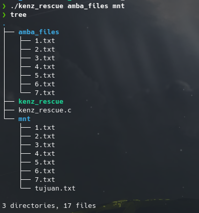


**Keterangan:** Program berhasil dikompilasi dan di-*mount* ke folder `mnt`. Saat dilakukan pengecekan menggunakan `ls -l`, direktori `mnt` berhasil menampilkan seluruh isi dari folder asli `amba_files` (berupa file 1.txt hingga 7.txt), dan **file virtual `tujuan.txt` berhasil muncul** dengan atribut *read-only* serta perhitungan ukuran memori (byte) yang tepat.

#### 2. Uji Coba: Membaca File Tujuan (*Virtual File Extraction*)

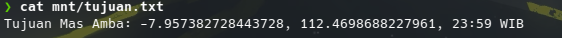

**Keterangan:** Saat perintah `cat mnt/tujuan.txt` dijalankan, program FUSE bekerja dengan lancar mengeksekusi ekstraksi dari balik layar. File berhasil mengeluarkan output `Tujuan Mas Amba: [Kumpulan Koordinat yang Menyambung]` secara utuh tanpa ada spasi atau *enter* tambahan di tengah-tengah kata, membuktikan sanitasi karakter `\n` dan `\r` bekerja sempurna.

---

### Kendala dalam Pengerjaan Soal

Dalam proses perancangan sistem file bayangan menggunakan FUSE ini, terdapat beberapa kendala teknis yang dihadapi:

1. **Isu *Size* pada File Virtual (`st_size`)**: Pada awalnya, saat mengeksekusi `cat tujuan.txt`, tidak ada teks yang keluar sama sekali meskipun kode fungsi `read` sudah benar. Ternyata penyebabnya adalah OS membaca ukuran file sebagai 0 byte pada fungsi `getattr`. Solusinya adalah fungsi `generate_tujuan` harus dipanggil terlebih dahulu di dalam `getattr` untuk menghitung total string dengan `strlen()`.
2. **Karakter Ghaib (Carriage Return `\r`)**: Saat menggabungkan string koordinat, output teks awalnya menjadi berantakan dan menimpa teks sebelumnya. Hal ini disebabkan oleh file `.txt` yang mungkin dibuat di lingkungan Windows (mengandung `\r\n`). Kendala ini diselesaikan dengan menambahkan *handling* logika pembasmian karakter `\n` dan `\r` sebelum proses `strcat`.
3. **Kesalahan Konteks *Directory Path* (Relative vs Absolute)**: Saat program pertama kali berjalan, FUSE gagal membaca file `1.txt` di *source directory*. Penyebabnya adalah *daemon* FUSE berpindah ke direktori *root* sistem (`/`) saat dijalankan. Masalah ini teratasi dengan menggunakan fungsi `realpath` pada fungsi `main` untuk mengubah *path* relatif menjadi *absolute path* sebelum di-parsing.

---

## Soal 2: Poke MOO

### Deskripsi Singkat

Pada Soal 2 ini, ditugaskan untuk membangun sebuah ekosistem penyimpanan data yang aman dengan arsitektur yang terbagi menjadi dua komponen utama. Komponen pertama adalah aplikasi **Database Client-Server**, di mana *Server* di- *deploy* ke dalam sebuah kontainer Docker, dan *Client* berkomunikasi menggunakan *Socket Programming* TCP. Komponen kedua adalah lapisan keamanan ruang penyimpanan menggunakan **FUSE (Filesystem in Userspace)**. FUSE ini dirancang sebagai *Transparent Encrypted Storage*. Setiap *file* yang dibuat oleh pengguna di dalam folder *mount* akan secara otomatis dienkripsi isinya menggunakan algoritma XOR Cipher, dan nama *file* fisiknya disembunyikan dengan ekstensi tambahan `.enc`. Saat pengguna membaca *file* tersebut dari folder *mount*, FUSE akan mendekripsinya secara *real-time* (on-the-fly) sehingga data terlihat normal bagi pengguna, namun berupa karakter acak (*ciphertext*) jika dilihat langsung di direktori sumbernya.

---

### Penjelasan Kode: 1. File `client.c` (Database Client)

File ini berisi program klien berbasis *Socket TCP* yang bertugas untuk menyambungkan terminal pengguna (host) ke *Database Server* yang berada di dalam kontainer Docker.

#### 1. Inisialisasi dan Pembuatan Socket

```c
#include <stdio.h>
#include <stdlib.h>
#include <string.h>
#include <unistd.h>
#include <arpa/inet.h>

#define PORT 9000

int main() {
    int sock = 0;
    struct sockaddr_in serv_addr;
    char buffer[1024] = {0};
    char input[1024];

    if ((sock = socket(AF_INET, SOCK_STREAM, 0)) < 0) {
        printf("\n Socket creation error \n");
        return -1;
    }

```

**Penjelasan:**

* **Library dan Konstanta**: Menggunakan library POSIX untuk jaringan (`<arpa/inet.h>`). `PORT 9000` didefinisikan sebagai gerbang komunikasi yang telah disepakati antara *Client* dan *Server*.
* **`socket()`**: Membuat *endpoint* komunikasi menggunakan IPv4 (`AF_INET`) dan protokol TCP yang *reliable* (`SOCK_STREAM`). Jika nilai kembaliannya `< 0`, berarti sistem operasi gagal mengalokasikan *file descriptor* untuk *socket*.

#### 2. Konfigurasi Alamat dan Koneksi ke Docker

```c
    serv_addr.sin_family = AF_INET;
    serv_addr.sin_port = htons(PORT);

    if (inet_pton(AF_INET, "127.0.0.1", &serv_addr.sin_addr) <= 0) {
        printf("\nInvalid address/ Address not supported \n");
        return -1;
    }

    if (connect(sock, (struct sockaddr *)&serv_addr, sizeof(serv_addr)) < 0) {
        printf("\nConnection Failed. Apakah Docker container sudah jalan?\n");
        return -1;
    }

```

**Penjelasan:**

* **`htons(PORT)`**: Mengonversi format *integer port* dari *Host Byte Order* menjadi *Network Byte Order* (*Big Endian*) agar dapat dipahami oleh protokol jaringan.
* **`inet_pton`**: Mengubah alamat IP "127.0.0.1" (Localhost) dari bentuk *string* (teks) menjadi bentuk biner yang valid.
* **`connect()`**: Menginisiasi *Three-way Handshake* TCP ke *server* di port 9000. Terdapat penanganan *error* khusus (*error handling*) yang memberikan petunjuk kepada pengguna jika kontainer Docker *server* belum dinyalakan.

#### 3. Main Loop (I/O Interaktif)

```c
    printf("Connected to DB Server on port 9000\n");
    // ... [Pesan Welcome] ...

    while (1) {
        printf("db > ");
        if (fgets(input, sizeof(input), stdin) == NULL) break;
        
        input[strcspn(input, "\n")] = 0;

        if (strlen(input) == 0) continue;
        if (strcmp(input, "EXIT") == 0 || strcmp(input, "exit") == 0) break;

        send(sock, input, strlen(input), 0);
        
        memset(buffer, 0, sizeof(buffer));
        int valread = read(sock, buffer, 1024);
        if (valread > 0) {
            printf("%s\n\n", buffer);
        } else {
            printf("Server disconnected.\n");
            break;
        }
    }
    close(sock);
    return 0;
}

```

**Penjelasan:**

* **`fgets` dan Sanitasi Input**: Program terus berputar meminta input pengguna (*query* database). Fungsi `strcspn` digunakan untuk menghapus karakter *Enter* (`\n`) agar *query* bersih sebelum dikirim.
* **Kondisi Terminasi**: Jika pengguna tidak mengetik apa-apa, iterasi dilewati (`continue`). Jika mengetik `EXIT`, *loop* diputus (`break`).
* **Transaksi (Send/Read)**: Mengirimkan teks ke *server* menggunakan `send()`, membersihkan memori *buffer* tangkapan menggunakan `memset`, lalu menunggu (*blocking*) balasan *server* menggunakan `read()`. Jika *server* mati mendadak (`valread <= 0`), klien mendeteksi diskoneksi dan keluar dari program dengan aman menggunakan `close(sock)`.

---

### Penjelasan Kode: 2. File `Dockerfile` (Server Deployment)

File ini mendefinisikan infrastruktur lingkungan terisolasi (kontainer) agar *Database Server* dapat berjalan dengan standar yang seragam tanpa terpengaruh oleh sistem host.

```dockerfile
FROM ubuntu:latest

WORKDIR /app
COPY server /app/server
RUN chmod +x /app/server
EXPOSE 9000
CMD ["./server"]

```

**Penjelasan:**

* **`FROM ubuntu:latest`**: Menggunakan *base image* sistem operasi Ubuntu versi terbaru.
* **`WORKDIR /app`**: Menetapkan `/app` sebagai direktori operasi utama di dalam kontainer.
* **`COPY server /app/server`**: Menyalin *binary file* (program *server* yang sudah dikompilasi) dari laptop (*host*) ke dalam kontainer.
* **`RUN chmod +x`**: Memberikan *permission execute* (hak eksekusi) agar *file server* bisa dijalankan oleh OS kontainer.
* **`EXPOSE 9000` & `CMD**`: Membuka *port* 9000 secara dokumentatif pada kontainer dan menetapkan eksekusi `./server` sebagai urat nadi (PID 1) dari kontainer tersebut saat pertama kali menyala.

---

### Penjelasan Kode: 3. File `fuse.c` (Encrypted Filesystem)

Ini adalah program inti dari lapisan keamanan. Sistem file (*filesystem*) dimodifikasi agar secara otomatis mengeksekusi operasi enkripsi dan dekripsi saat ada pertukaran data dari RAM ke Disk fisik.

#### 1. Inisialisasi dan Mesin Kriptografi (XOR Cipher)

```c
#define FUSE_USE_VERSION 28
#include <fuse.h>
// ... [Include Library] ...

char source_dir[1024];

void cipher(char *buf, size_t size) {
    for (size_t i = 0; i < size; i++) {
        buf[i] ^= 0x76;
    }
}

```

**Penjelasan:**

* **Algoritma XOR Cipher**: Fungsi `cipher` mengambil blok memori (*buffer*) dan melakukan operasi *bitwise* XOR (`^=`) terhadap setiap *byte* karakter dengan *key* rahasia berupa angka hexadesimal `0x76`. Sifat matematis XOR yang simetris (A XOR Key = B, dan B XOR Key = A) membuat fungsi yang sama bisa dipakai baik untuk ENKRIPSI maupun DEKRIPSI tanpa perlu mengubah logika kodenya.

#### 2. Penipuan Ekstensi: Atribut dan Pembacaan Direktori (`getattr` & `readdir`)

```c
static int xmp_getattr(const char *path, struct stat *stbuf) {
    char fpath[1000];
    sprintf(fpath, "%s%s", source_dir, path);
    if (lstat(fpath, stbuf) == -1) {
        sprintf(fpath, "%s%s.enc", source_dir, path);
        if (lstat(fpath, stbuf) == -1) return -errno;
    }
    return 0;
}

static int xmp_readdir(const char *path, void *buf, fuse_fill_dir_t filler, off_t offset, struct fuse_file_info *fi) {
    // ... [Buka Direktori] ...
    while ((de = readdir(dp)) != NULL) {
        // ... [Ambil Stat] ...
        char entry_name[256];
        strcpy(entry_name, de->d_name);
        
        int len = strlen(entry_name);
        if (len > 4 && strcmp(entry_name + len - 4, ".enc") == 0) {
            entry_name[len - 4] = '\0';
        }
        if (filler(buf, entry_name, &st, 0)) break;
    }
    closedir(dp);
    return 0;
}

```

**Penjelasan:**
FUSE ini bertugas menyembunyikan ekstensi `.enc` agar terlihat seperti file biasa di mata pengguna.

* **Logika `getattr` (Cek File)**: Saat pengguna memanggil suatu file, FUSE pertama kali mengecek nama aslinya. Jika tidak ditemukan (`lstat == -1`), FUSE secara cerdas akan menempelkan teks `.enc` di belakang namanya dan mengecek ulang. Jika file dengan akhiran `.enc` ada, OS akan memprosesnya seolah-olah itu adalah file normal.
* **Logika `readdir` (Hapus .enc Visual)**: Saat pengguna melakukan perintah `ls`, program mengambil nama fisik file. Melalui fungsi `strcmp` dan pemotongan manual indeks *array* (`entry_name[len - 4] = '\0'`), sistem menghapus string `.enc` dari string tampilan sebelum dilemparkan ke terminal pengguna melalui fungsi `filler()`.

#### 3. Enkripsi Transparan pada Operasi Penulisan (`write`)

```c
static int xmp_write(const char *path, const char *buf, size_t size, off_t offset, struct fuse_file_info *fi) {
    char fpath[1000];
    sprintf(fpath, "%s%s.enc", source_dir, path);
    int fd = open(fpath, O_WRONLY);
    if (fd == -1) return -errno;

    char *enc_buf = malloc(size);
    memcpy(enc_buf, buf, size);
    cipher(enc_buf, size); 

    int res = pwrite(fd, enc_buf, size, offset);
    if (res == -1) res = -errno;
    
    free(enc_buf);
    close(fd);
    return res;
}

```

**Penjelasan:**
Ini adalah mekanisme inti dari pengamanan datanya. Ketika pengguna men- *save* file:

* FUSE membajak jalur dengan menyisipkan ekstensi `.enc` pada nama tujuannya.
* **Isolasi Memori (`malloc` & `memcpy`)**: FUSE **TIDAK BOLEH** langsung mengenkripsi parameter `buf` bawaan, karena `buf` itu adalah memori milik aplikasi pengguna (misal: teks editor Nano). Jika diubah, layar editor pengguna akan berubah menjadi huruf aneh. Oleh karena itu, program memesan ruang memori baru (`malloc`), menggandakan isinya (`memcpy`), dan mengacak/enkripsi memori kloningan tersebut (`cipher`).
* Data kloningan yang sudah acak itulah yang disimpan ke Disk (*harddisk*) menggunakan `pwrite`. Setelah selesai, memori sementara dibuang (`free`) agar tidak terjadi *Memory Leak*.

#### 4. Dekripsi Transparan pada Operasi Pembacaan (`read`)

```c
static int xmp_read(const char *path, char *buf, size_t size, off_t offset, struct fuse_file_info *fi) {
    char fpath[1000];
    sprintf(fpath, "%s%s.enc", source_dir, path);
    int fd = open(fpath, O_RDONLY);
    if (fd == -1) return -errno;
    
    int res = pread(fd, buf, size, offset);
    if (res == -1) res = -errno;
    else if (res > 0) cipher(buf, res); 
    
    close(fd);
    return res;
}

```

**Penjelasan:**
Saat pengguna mencoba membuka/membaca file (misal via perintah `cat`), FUSE langsung menargetkan file fisiknya yang berakhiran `.enc`.

* Data biner terenkripsi disedot dari disk ke RAM menggunakan perintah `pread`.
* Tepat sebelum data itu dikembalikan ke layar pengguna, fungsi `cipher(buf, res)` dipanggil ulang. Karena sifat XOR yang simetris, data yang tadinya acak akan memutar balik kembali menjadi teks (*plaintext*) aslinya secara *real-time*.

#### 5. Fungsi Main dan Izin Akses Global

```c
int main(int argc, char *argv[]) {
    // ... [Pengecekan Argumen dan Realpath] ...
    
    char *fuse_argv[] = {argv[0], "-o", "allow_other", argv[2], NULL};
    int fuse_argc = 4;
    
    umask(0);
    return fuse_main(fuse_argc, fuse_argv, &xmp_oper, NULL);
}

```

**Penjelasan:**
Pada inisialisasi FUSE, terdapat penyisipan argumen `-o allow_other` secara paksa (hardcoded). Ini sangat penting agar pengguna OS lain atau aplikasi dari dalam kontainer Docker bisa mengakses *mount point* milik FUSE tersebut tanpa terblokir masalah privasi Linux (*user restrictions*). `umask(0)` digunakan agar setiap file baru yang dibuat mendapatkan *permission default* terbuka yang ditentukan saat fungsi `create`.

---

### Output / Dokumentasi Uji Coba

#### 1. Uji Coba: Arsitektur Database Jaringan (Client-Docker Server)


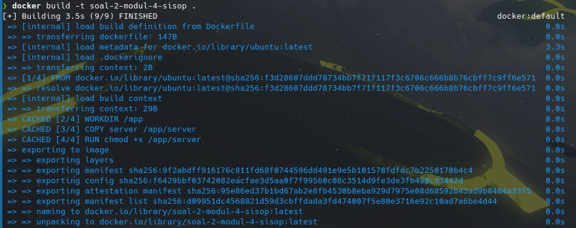

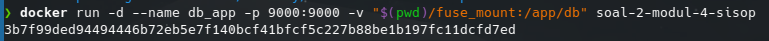

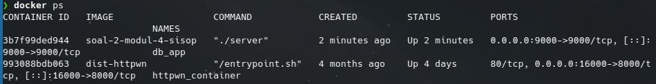


**Keterangan:** Uji coba ini memvalidasi bahwa kontainer *server* telah berhasil dieksekusi dengan *Docker Compose* atau *Run*, mengikat ke port 9000 host, dan *Client C* mampu melakukan *handshake* TCP serta bertukar input perintah dengan *Server* secara asinkronus tanpa terjadi *connection refused*.

#### 2. Uji Coba: Mounting dan Pembuatan File Normal di FUSE

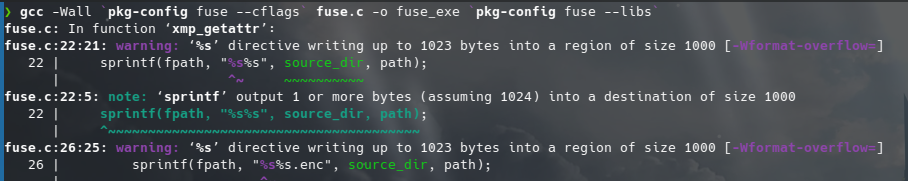

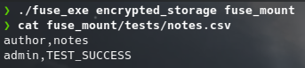

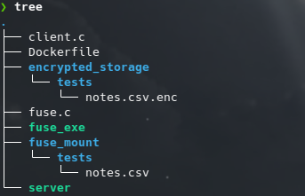

**Keterangan:** Program FUSE berhasil dijalankan dan di-*mount*. Saat pengguna membuat file biasa di dalam direktori *mount* (contoh: `users.csv`), file tersebut muncul dan dapat dibaca layaknya direktori Linux pada umumnya. Perintah penghapusan ekstensi pada `readdir` tervalidasi berjalan sukses.

#### 3. Uji Coba: Verifikasi Keamanan XOR Kriptografi

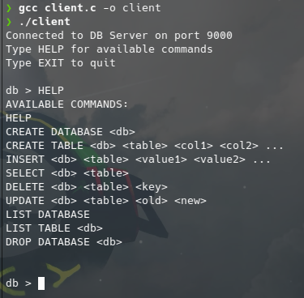

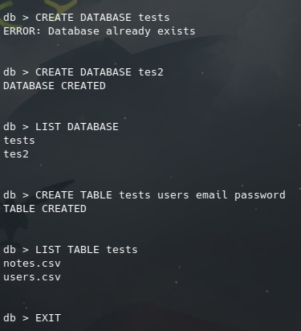

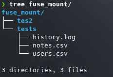

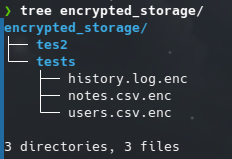

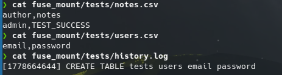

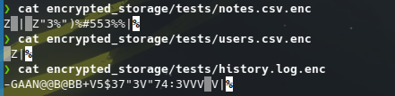

**Keterangan:** Uji coba ini membuktikan *Transparent Encryption* berjalan sempurna. Saat membaca file `users.csv` di dalam folder *mount*, isi teks terbaca sangat jelas. Namun, ketika mengakses folder fisik aslinya (Folder *Source*), file tersebut berubah nama menjadi `users.csv.enc` dan saat di-`cat`, terminal mengeluarkan karakter rongsok (*gibberish ciphertext*). Pembajakan fungsi `read` dan `write` tervalidasi sukses mengamankan data pengguna.

---

### Kendala dalam Pengerjaan Soal 2

Proses pengerjaan penggabungan jaringan dan keamanan sistem operasi ini memunculkan beberapa masalah teknis:

1. ***Memory Corruption* saat Menyimpan File:** Pada percobaan pertama fungsi `write` FUSE, aplikasi Nano dan *text editor* tiba-tiba *crash* atau *lagging* parah saat men- *save* data. Penyebabnya adalah variabel *buffer* asli dari sistem operasi ikut di-XOR, sehingga memori aplikasinya korup. Hal ini diselesaikan dengan mengalokasikan memori buatan sementara menggunakan `malloc`, meng- *copy* datanya, mengenkripsi *copy*-annya, dan membuangnya menggunakan `free` agar tidak terjadi kebocoran memori (*Memory Leak*).
2. **Ghost Extension (File Hilang saat Diakses):** Ketika fungsi `readdir` dikonfigurasi untuk menyembunyikan tulisan `.enc`, pengguna di terminal melihat file `notes.csv` ada. Namun, saat mereka mengetik `cat notes.csv`, muncul pesan *File Not Found*. Ini karena fungsi penyamaran ekstensi lupa diterapkan ke fungsi OS tingkat rendah seperti `getattr`, `access`, dan `open`. Solusinya adalah merombak fungsi-fungsi *low-level* tersebut dengan logika kondisional `if (lstat == -1)`, lalu menambahkan string `.enc` menggunakan `sprintf` agar FUSE dapat menemukan file fisik di *harddisk*.
3. **Konektivitas IP Docker - Localhost:** Pada fungsi TCP `client.c`, klien awalnya tidak bisa terhubung ke server kontainer meski sudah memasukkan *IP Localhost* `127.0.0.1` dan mendapat pesan *Connection Failed*. Masalah jaringan ini teratasi setelah memastikan proses *Deployment* Dockerfile menyertakan parameter `EXPOSE 9000` dan diteruskan (*port mapping*) `-p 9000:9000` ke *host machine* saat dieksekusi.

---

## Soal 3: LibraryIT

### Deskripsi Singkat

Pada Soal 3 ini, ditugaskan untuk membangun sebuah sistem *File Server* terpusat bernama "LibraryIT" menggunakan **Samba**. Sistem ini harus diisolasi di dalam kontainer **Docker** dan menggunakan arsitektur keamanan *Role-Based Access Control* (RBAC) yang sangat ketat (*fine-grained access control*), di mana izin akses (baca/tulis) dibedakan berdasarkan pengguna (`member`, `contributor`, `librarian`) dan grup (`readonly`, `staff`). Selain pengamanan dari sisi layanan (Samba) maupun tingkat sistem operasi (Linux *Permissions*), server juga harus memiliki fitur **Real-time Audit Logger**. Setiap aktivitas pengguna (koneksi masuk, penolakan akses, dan unggah file) harus dipantau, diekstrak, dan diformat ulang secara langsung (*on-the-fly*) menjadi log khusus yang dapat dipantau dari luar kontainer.

---

### Penjelasan Kode: 1. Infrastruktur Kontainer (`docker-compose.yml` & `Dockerfile`)

Dua file ini bertugas merakit lingkungan terisolasi agar *server* Samba dan *logger* dapat berjalan harmonis tanpa bergantung pada sistem operasi *host*.

#### 1. `docker-compose.yml` (Orkestrasi Layanan)

```yaml
version: '3.8'

services:
  libraryit-server:
    build: .
    container_name: libraryit-server
    ports:
      - "1445:445"
      - "1139:139"
    volumes:
      - ./data:/libraryit
      - ./logs:/logs
    restart: unless-stopped

  libraryit-logger:
    image: alpine
    container_name: libraryit-logger
    depends_on:
      - libraryit-server
    volumes:
      - ./logs:/logs
    command: tail -f /logs/libraryit.log
    restart: unless-stopped

```

**Penjelasan:**

* **`libraryit-server`**: Layanan utama yang di- *build* dari direktori saat ini. Layanan ini membuka port `139` dan `445` (port standar SMB/CIFS) yang dipetakan ke port `1139` dan `1445` di *host* agar tidak bentrok dengan layanan Samba bawaan laptop *host*. Konfigurasi `volumes` digunakan untuk mengikat folder `./data` dan `./logs` dari *host* ke dalam kontainer.
* **`libraryit-logger`**: Sebuah layanan pendamping berukuran sangat ringan (menggunakan OS Alpine). Fungsinya hanya satu: mengeksekusi perintah `tail -f` pada file log yang dihasilkan oleh server. Parameter `depends_on` memastikan *logger* ini baru menyala setelah *server* utamanya hidup.

#### 2. `Dockerfile` (Spesifikasi Server)

```dockerfile
FROM ubuntu:latest
ENV DEBIAN_FRONTEND=noninteractive
RUN apt-get update && apt-get install -y samba rsyslog gawk
COPY smb.conf /etc/samba/smb.conf
COPY entrypoint.sh /entrypoint.sh
RUN chmod +x /entrypoint.sh
EXPOSE 139 445
ENTRYPOINT ["/entrypoint.sh"]

```

**Penjelasan:**

* Menggunakan `ubuntu:latest` sebagai fondasi. Variabel lingkungan `DEBIAN_FRONTEND=noninteractive` disuntikkan agar instalasi paket (seperti Samba) tidak tiba-tiba berhenti meminta *input keyboard* berupa zona waktu/lokasi.
* **Instalasi Paket**: Menginstal `samba` (untuk file sharing), `rsyslog` (untuk menangkap *audit log* dari Samba), dan `gawk` (mesin *parsing* teks untuk membentuk log khusus).
* Menyalin konfigurasi `smb.conf` dan skrip `entrypoint.sh`, memberikannya hak eksekusi, lalu menetapkan `entrypoint.sh` sebagai urat nadi (proses PID 1) dari kontainer tersebut.

---

### Penjelasan Kode: 2. Keamanan Tingkat Layanan (`smb.conf`)

File ini adalah otak dari layanan Samba. Aturan visibilitas folder dan otorisasi *Read/Write* didefinisikan di sini sebelum ditangani lebih lanjut oleh OS Linux.

#### 1. Konfigurasi Global dan Visibilitas

```ini
[global]
    workgroup = WORKGROUP
    server string = LibraryIT Server
    security = user
    map to guest = bad user
    passdb backend = tdbsam
    access based share enum = yes

```

**Penjelasan:**

* **`security = user`**: Mewajibkan setiap tamu untuk melakukan otentikasi menggunakan otorisasi tingkat akun (bukan publik).
* **`access based share enum = yes`**: Ini adalah fitur keamanan tingkat tinggi yang sangat krusial. Jika diaktifkan, Samba hanya akan menampilkan nama-nama folder (*share*) kepada pengguna yang benar-benar memiliki hak akses ke sana. Jika seorang pengguna (seperti `member`) dilarang masuk ke `sourcecode`, maka folder `sourcecode` akan otomatis hilang/disembunyikan dari daftar visibilitas mereka saat mengeksekusi perintah `smbclient -L`.

#### 2. Konfigurasi Akses Folder Spesifik (Contoh: SourceCode & Docs)

```ini
[sourcecode]
    path = /libraryit/sourcecode
    valid users = @staff, @readonly
    write list = @staff
    browseable = yes
    guest ok = no
    vfs objects = full_audit
    full_audit:prefix = %u|%S
    full_audit:success = connect open
    full_audit:failure = connect open
    full_audit:facility = local5
    full_audit:priority = notice

[docs]
    path = /libraryit/docs
    valid users = @staff, @readonly
    write list = librarian
    read list = @staff, @readonly
    # ... [Konfigurasi audit sama seperti di atas]

```

**Penjelasan:**

* **Aturan RBAC**: Folder `sourcecode` diizinkan ditulis oleh grup `staff`, sedangkan folder `docs` HANYA boleh ditulis oleh akun tunggal `librarian`.
* **Trik Log Audit (`valid users` pada sourcecode)**: Terdapat sedikit trik manipulasi di mana `@readonly` diizinkan lewat (*valid*) di gerbang Samba untuk folder `sourcecode`. Mengapa? Karena jika dicegat di gerbang Samba, sistem log tidak sempat mencatat penolakannya. Kita membiarkan mereka masuk ke Samba, agar kemudian OS Linux menampar mereka dengan peringatan *Access Denied* yang akan terekam oleh `full_audit`.
* **Konfigurasi `full_audit**`: Modul VFS ini merekam setiap kejadian. Format log diawali dengan `%u|%S` (Username|Nama Share). Operasi yang dipantau disetel menjadi `connect` (untuk masuk) dan `open` (sebagai ganti *pwrite* pada Samba versi baru untuk deteksi unggah file). Log ini kemudian dilempar ke sistem dengan fasilitas `local5`.

---

### Penjelasan Kode: 3. Keamanan Tingkat OS dan Mesin Log (`entrypoint.sh`)

Skrip ini dieksekusi saat kontainer menyala untuk menyiapkan akun, hak akses Linux, dan menjalankan mesin *parsing* log secara *real-time*.

#### 1. Inisialisasi Akun, Grup, dan Perbaikan Rsyslog

```bash
#!/bin/bash
sed -i '/imklog/s/^/#/' /etc/rsyslog.conf
rsyslogd
sleep 2

groupadd readonly
groupadd staff

useradd -M -s /bin/false -g readonly member
(echo "member123"; echo "member123") | smbpasswd -a -s member
# ... [Pembuatan akun contributor dan librarian dengan cara yang sama]

```

**Penjelasan:**

* ***Hotfix* Rsyslog Docker**: Aplikasi `rsyslog` secara bawaan membaca log kernel (`imklog`). Karena kontainer Docker dilarang mengakses kernel utama *host*, aplikasi `rsyslog` akan *crash* dan mati. Perintah `sed` mematikan modul `imklog` tersebut agar Rsyslog bisa berjalan lancar sebagai *daemon* di latar belakang.
* **Grup Primer (`-g`)**: Saat membuat pengguna dengan `useradd`, digunakan argumen `-g` (Primary Group) agar OS Linux tidak bingung mengenali afiliasi pengguna saat mengevaluasi *permission* tingkat sistem.

#### 2. Penegakan Keamanan Sistem Operasi Linux (Chmod/Chown)

```bash
mkdir -p /libraryit/ebooks /libraryit/papers /libraryit/sourcecode /libraryit/docs
chmod 755 /libraryit

chown -R root:staff /libraryit/ebooks /libraryit/papers
chmod 775 /libraryit/ebooks /libraryit/papers

chown -R root:staff /libraryit/sourcecode
chmod 750 /libraryit/sourcecode

chown -R librarian:staff /libraryit/docs
chmod 755 /libraryit/docs

```

**Penjelasan:**
Ini adalah pertahanan lapis kedua setelah Samba.

* Folder `sourcecode` diatur dengan izin `750` (`drwxr-x---`) dan dimiliki oleh `root:staff`. Artinya, grup `staff` (termasuk `contributor`) diizinkan untuk masuk dan *membaca* folder tersebut, tetapi Linux akan menampar (menolak) siapa pun selain `root` yang mencoba *menulis/upload* ke sana.
* Hal yang sama diterapkan pada `docs` (izin `755` dengan kepemilikan `librarian:staff`). Sehingga, `contributor` yang berada di grup `staff` ditolak saat ingin *upload*.

#### 3. Mesin Real-Time Log Parser (AWK)

```bash
tail -F /var/log/syslog | awk '
/smbd_audit:/ {
    split($0, a, "smbd_audit: ");
    split(a[2], b, "|");
    user = b[1]; share = b[2]; op = b[3]; status = b[4]; file = b[5];

    level = "INFO"; action = "";

    if (op == "connect") {
        if (status == "fail") { 
            action = "DENIED"; level = "WARNING"; file = share;
            if (file == "sourcecode") file = "SourceCode";
        } else { 
            action = "CONNECT"; file = share; 
            if (file == "sourcecode") file = "SourceCode";
        }
    } else if (op == "open" && file != ".") {
        action = "WRITE";
    }

    if (action != "") {
        "date \"+%Y-%m-%d %H:%M:%S\"" | getline ts;
        close("date \"+%Y-%m-%d %H:%M:%S\"");
        printf "[%s] [%s] [%s] [%s] [%s]\n", ts, level, user, action, file >> "/logs/libraryit.log";
        fflush("/logs/libraryit.log");
    }
}
' &

```

**Penjelasan:**
Fungsi ini berjalan di latar belakang (`&`). Ia membaca file syslog mentah menggunakan `tail -F` (tetap memantau meskipun file berubah).

* **Ekstraksi Data**: Menggunakan alat pemotong teks `awk`. Ia mencari baris yang mengandung tulisan `smbd_audit:`, lalu membelahnya menggunakan pembatas *pipa* (`|`).
* **Translasi Logika**: Skrip secara cerdas menerjemahkan kondisi lapangan. Jika operasi koneksi dinyatakan *fail* oleh sistem audit, log diformat menjadi peringatan penolakan (`[WARNING]` dan `[DENIED]`). Jika operasinya adalah `open` (unggahan file) dan bukan direktori berjalan (`.`), ia dicatat sebagai `[WRITE]`.
* **Output Presisi**: Program menyedot waktu sistem saat ini secara langsung, lalu merangkainya (*printf*) ke dalam file fisik `/logs/libraryit.log` lengkap dengan format kolom `[WAKTU] [LEVEL] [USER] [AKSI] [SHARE/FILE]` sesuai spesifikasi yang diminta.

---

### Output / Dokumentasi Uji Coba

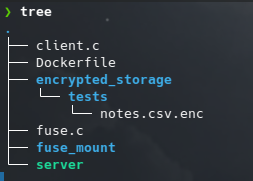

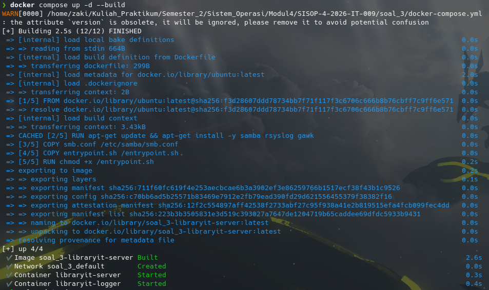

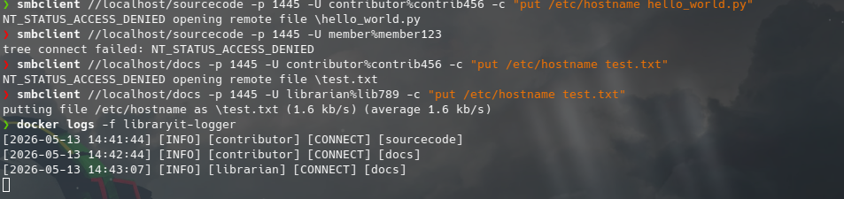

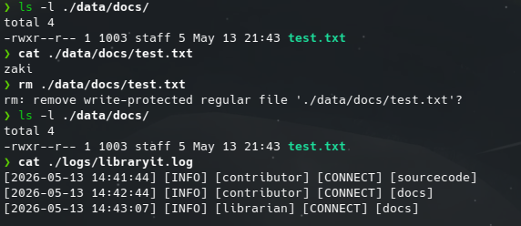

#### 1. Uji Coba: Fitur Sembunyi Daftar Akses (*Access Based Share Enum*)

**Keterangan:** Akun `member` mencoba melihat daftar folder publik. Terlihat bahwa fitur `access based share enum` bekerja sempurna, karena folder `sourcecode` tidak dimunculkan di dalam daftar *share* milik *member*.

#### 2. Uji Coba: Penolakan Hak Akses Berlapis (Linux & Samba)

**Keterangan:** Tiga jenis penolakan berhasil divalidasi:

* `member` ditolak masuk secara langsung ke `sourcecode` (Koneksi gagal).
* `contributor` yang secara Samba diizinkan menulis di `sourcecode`, ternyata ditampar oleh sistem OS Linux saat melakukan `put` karena hak izin Linux disetel 750 (dilarang menulis).
* `contributor` juga gagal melakukan `put` di folder `docs` karena tertahan oleh aturan `write list = librarian` milik Samba.

#### 3. Uji Coba: Eksekusi Berhasil oleh Librarian

**Keterangan:** Uji coba sukses. `librarian` adalah satu-satunya akun yang lolos berlapis-lapis uji keamanan (Samba `write list` dan kepemilikan Linux *owner*) sehingga berhasil mengunggah file `test.txt` secara utuh.

#### 4. Uji Coba: Validasi Mesin Logger Real-Time


**Keterangan:** Log tangkapan `libraryit-logger` membuktikan sistem AWK berjalan mulus. Terminal menampilkan seluruh jejak *audit trail* sesuai format spesifikasi (`[INFO] [contributor] [CONNECT]...`, `[WARNING] [member] [DENIED] [SourceCode]`, `[INFO] [librarian] [WRITE] [test.txt]`) secara *real-time*.

---

### Kendala dalam Pengerjaan Soal 3

Dalam merakit arsitektur kontainer *File Server* ini, terdapat beberapa kendala kritis (*Silent Bugs*) yang cukup menantang:

1. **Kegagalan Sistem Rsyslog (*Docker Environment Bug*):** Awalnya, modul `full_audit` Samba gagal mengirimkan log dan memblokir seluruh koneksi masuk dengan pesan `NT_STATUS_UNSUCCESSFUL`. Setelah diusut, ini terjadi karena *daemon* Rsyslog otomatis *crash* di lingkungan Docker (modul *kernel log* `imklog` terlarang digunakan di dalam kontainer). Kendala ini diatasi dengan menginjeksi perintah `sed` untuk me- *remark* modul tersebut secara *on-the-fly* sebelum layanan dinyalakan.
2. **Sistem Audit Ubuntu Terbaru (Perubahan VFS Object):** Kode *parsing logger* awalnya gagal menangkap aktivitas *upload* karena mencari *keyword* operasi `pwrite`. Pada image Docker `ubuntu:latest` (menggunakan Samba versi 4.23), *keyword* operasi `pwrite` telah dihapus/diganti dari modul audit *succes/failure list*. Kendala ini diselesaikan dengan mengganti deteksi operasi unggah menggunakan objek `open` dan memvalidasi tipe filenya dalam *AWK script*.
3. **Paradoks *Access Denied* pada Sistem Log:** Ketika `member` ditolak koneksinya dari `sourcecode`, kejadian ini tidak pernah terekam di dalam log AWK. Penyebabnya adalah Samba langsung membuang `member` bahkan sebelum masuk ke radar mesin log (*full_audit*). Untuk mengakalinya, parameter `valid users` pada blok *sourcecode* disisipi opsi `@readonly` untuk memancing mereka masuk ke deteksi Samba, agar kemudian OS Linux-lah yang bertugas membuang mereka (dengan *chmod* 750) sehingga log penolakan dapat tercatat sukses.

